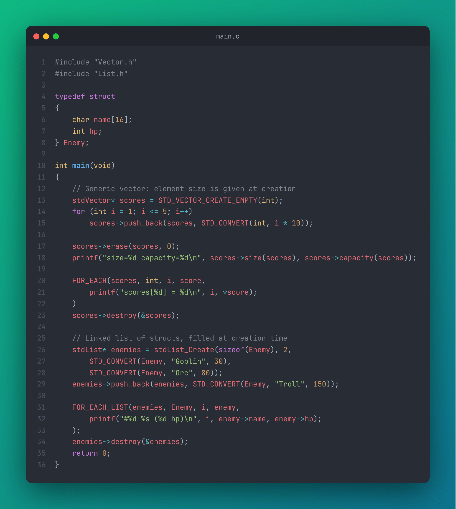
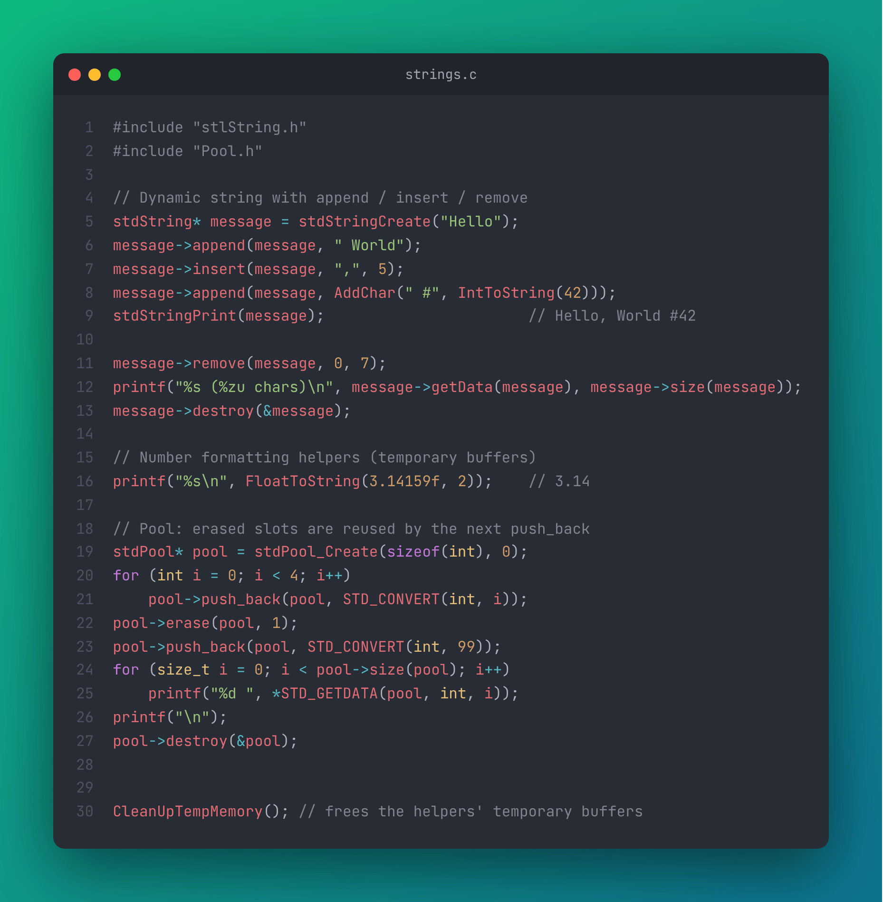

# C_STL

**A small "STL-like" library for C**: generic `vector`, doubly linked `list`, slot-reusing `pool` and a dynamic `string`, all usable with any element type through an object-like API (`container->push_back(container, ...)`).


C_STL is the container layer used by [BreakerEngine](https://github.com/Xanhos/BreakerEngine), a CSFML game engine.

<p align="center">
  
  
</p>

---

## 📑 Table of Contents

- [Features](#-features)
- [Getting Started](#-getting-started)
- [Quick Example](#-quick-example)
- [API Reference](#-api-reference)
  - [stdVector](#stdvector)
  - [stdList](#stdlist)
  - [stdPool](#stdpool)
  - [stdString](#stdstring)
  - [Helper Macros](#helper-macros)
- [Running the Tests](#-running-the-tests)
- [Project Structure](#-project-structure)
- [Documentation](#-documentation)
- [License](#-license)

---

## ✨ Features

| Container | Description |
| --- | --- |
| **`stdVector`** | Contiguous dynamic array with `reserve`, `shrink_to_fit` and `capacity`. |
| **`stdList`** | Doubly linked list with direct access to the first link for fast iteration. |
| **`stdPool`** | Array of slots: erased slots are recycled by the next `push_back`. |
| **`stdString`** | Dynamic string with `append`, `insert`, `replace`, `remove`. |
| **Helpers** | Number → string conversions, `STD_CONVERT` compound literals and `FOR_EACH` loops. |

* **Generic:** containers store raw bytes, the element size is given at creation (`sizeof(MyStruct)`).
* **Object-like API:** every container is a struct of function pointers, so calls read like methods.
* **Variadic constructors:** fill a container directly at creation time.
* **Safe destruction:** `destroy(&container)` releases memory and sets your pointer to `NULL`.

---

## 🚀 Getting Started

### Prerequisites

* A C23 compiler (MSVC, the project is configured as a Windows DLL)
* [CMake](https://cmake.org/) **4.0+** and [Ninja](https://ninja-build.org/) (used by the presets)

### Build

```bash
git clone https://github.com/Xanhos/C_STL.git
cd C_STL

# Configure + build with the provided presets
cmake --preset release
cmake --build --preset release
```

Binaries are written to `bin/debug` or `bin/release`: `C_STL.dll` / `C_STL.lib` and the `C_STL_Test` executable.

### Use it in your project

**With CMake** (as a subdirectory):

```cmake
add_subdirectory(C_STL)
target_link_libraries(MyGame PRIVATE C_STL)
```

**Manually:** add the `C_STL` folder to your include paths, link against `C_STL.lib` and ship `C_STL.dll` next to your executable.

> [!NOTE]
> Symbols are exported with `__declspec(dllexport/dllimport)` and the implementation relies on MSVC functions such as `strcpy_s` / `memcpy_s`, so the library currently targets **Windows**.

---

## ⚡ Quick Example

```c
#include "Vector.h"
#include "List.h"

typedef struct
{
    char name[16];
    int hp;
} Enemy;

int main(void)
{
    // Generic vector: element size is given at creation
    stdVector* scores = STD_VECTOR_CREATE_EMPTY(int);
    for (int i = 1; i <= 5; i++)
        scores->push_back(scores, STD_CONVERT(int, i * 10));

    scores->erase(scores, 0);
    printf("size=%d capacity=%d\n", scores->size(scores), scores->capacity(scores));

    FOR_EACH(scores, int, i, score,
        printf("scores[%d] = %d\n", i, *score);
    )
    scores->destroy(&scores);

    // Linked list of structs, filled at creation time
    stdList* enemies = stdList_Create(sizeof(Enemy), 2,
        STD_CONVERT(Enemy, "Goblin", 30),
        STD_CONVERT(Enemy, "Orc", 80));
    enemies->push_back(enemies, STD_CONVERT(Enemy, "Troll", 150));

    FOR_EACH_LIST(enemies, Enemy, i, enemy,
        printf("#%d %s (%d hp)\n", i, enemy->name, enemy->hp);
    );
    enemies->destroy(&enemies);
    return 0;
}
```

Output:

```text
size=4 capacity=8
scores[0] = 20
scores[1] = 30
scores[2] = 40
scores[3] = 50
#0 Goblin (30 hp)
#1 Orc (80 hp)
#2 Troll (150 hp)
```

---

## 📚 API Reference

Every container follows the same pattern: create it with `xxx_Create`, call its functions through the pointer (always passing the container as first argument), and release it with `destroy(&container)`.

### stdVector

```c
stdVector* stdVector_Create(size_t elementSize, unsigned int count, ...);
STD_VECTOR_CREATE_EMPTY(type)            // shortcut for an empty vector of `type`
```

| Function | Description |
| --- | --- |
| `push_back(vec, void* element)` | Copies `element` at the end. |
| `erase(vec, int index)` | Removes the element at `index` (order is preserved). |
| `getData(vec, int index)` | Returns a `void*` to the element, cast it or use `STD_GETDATA`. |
| `size(vec)` / `capacity(vec)` | Number of elements / allocated slots. |
| `reserve(vec, unsigned int n)` | Pre-allocates memory for `n` elements. |
| `shrink_to_fit(vec)` | Reduces the capacity to the current size. |
| `clear(vec)` | Removes every element (does not free memory owned by the elements). |
| `destroy(&vec)` | Frees the vector and sets the pointer to `NULL`. |

### stdList

```c
stdList* stdList_Create(size_t elementSize, int count, ...);
STD_LIST_CREATE_EMPTY(type)
```

| Function | Description |
| --- | --- |
| `push_back(list, void* element)` | Appends a copy of `element`. |
| `erase(list, unsigned int index)` | Removes the element at `index`. |
| `getData(list, unsigned int index)` | Returns a `void*` to the element (`NULL` if out of range). |
| `get_first_link(list)` | Returns the first `Link` (`data`, `pNext`, `pBack`, `id`) for manual iteration. |
| `size(list)` / `clear(list)` / `destroy(&list)` | Same as the vector. |

### stdPool

```c
stdPool* stdPool_Create(size_t elementSize, unsigned int count, ...);
```

A pool keeps its slots allocated: `erase` frees a slot, and the next `push_back` fills the first free slot instead of growing.

```c
stdPool* pool = stdPool_Create(sizeof(int), 0);
for (int i = 0; i < 4; i++)
    pool->push_back(pool, STD_CONVERT(int, i));

pool->erase(pool, 1);
pool->push_back(pool, STD_CONVERT(int, 99));   // reuses slot 1 -> 0 99 2 3
pool->destroy(&pool);
```

### stdString

```c
stdString* stdStringCreate(const char* initialValue);
```

| Function | Description |
| --- | --- |
| `append(str, const char*)` | Appends text at the end. |
| `insert(str, const char*, size_t index)` | Inserts text at `index`. |
| `replace(str, const char*)` | Replaces the whole content. |
| `remove(str, size_t index, size_t length)` | Removes `length` characters from `index`. |
| `getData(str)` / `size(str)` | Read-only `const char*` / length. |
| `destroy(&str)` | Frees the string. |

Free helpers: `stdStringPrint`, `CopyAndAllocChar`, `AddChar`, `IntToString`, `LongToString`, `ShortToString`, `FloatToString(value, decimals)`, `CharToString`.

```c
stdString* message = stdStringCreate("Hello");
message->append(message, " World");
message->insert(message, ",", 5);
message->append(message, AddChar(" #", IntToString(42)));
stdStringPrint(message);                       // Hello, World #42
message->destroy(&message);

CleanUpTempMemory();
```

> [!WARNING]
> The conversion helpers (`AddChar`, `IntToString`, `FloatToString`…) return **temporary buffers**. Copy the result (`strdup`, `CopyAndAllocChar`) if you need to keep it, and call `CleanUpTempMemory()` to release them.

### Helper Macros

| Macro | Description |
| --- | --- |
| `STD_CONVERT(type, ...)` | Builds a compound literal and returns its address: `STD_CONVERT(Enemy, "Orc", 80)`. |
| `STD_GETDATA(container, type, index)` | Typed access: `*STD_GETDATA(vec, int, 0)`. |
| `FOR_EACH(container, type, it, element, body)` | Loops over a vector or pool, `element` is a `type*`. |
| `FOR_EACH_POINTER(container, type, it, element, body)` | Same, for containers storing pointers (`element` is the pointer). |
| `FOR_EACH_LIST(list, type, it, element, body)` | Walks a `stdList` link by link. |
| `FOR_EACH_LIST_POINTER(list, type, it, element, body)` | Same, for lists storing pointers. |
| `FOR_EACH_TEMP` / `FOR_EACH_LIST_TEMP` | Iterate over a temporary container and destroy it afterwards. |

---

## 🧪 Running the Tests

`C_STL_Test` runs a full test suite (`C_STL_Test/test_suite.c`) covering creation, insertion, erase at every position, clear, reserve, pool slot reuse and string edge cases:

```bash
cmake --build --preset release
./bin/release/C_STL_Test
```

Set `RUN_FULL_SUITE` to `0` in `C_STL_Test/main.c` to run the individual regression tests instead.

---

## 📂 Project Structure

```text
C_STL/
├── C_STL/
│   ├── Export.h          # DLL export macro + STD_CONVERT / FOR_EACH helpers
│   ├── Vector.h/.c       # stdVector
│   ├── List.h/.c         # stdList
│   ├── Pool.h/.c         # stdPool
│   └── stlString.h/.c    # stdString + conversion helpers
├── C_STL_Test/           # Test executable and test suite
├── CMakeLists.txt
└── CMakePresets.json     # debug / release presets (Ninja)
```

---

## 📖 Documentation

More documentation is available on [Notion](https://breaker-engine.notion.site/Documentation-f194d55b638a4532b35b2687a67d4ead).

---

## 📝 License

MIT License © 2024 Yann Grallan (see the header of each source file).
